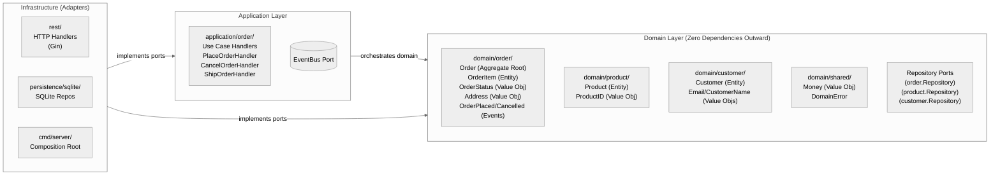
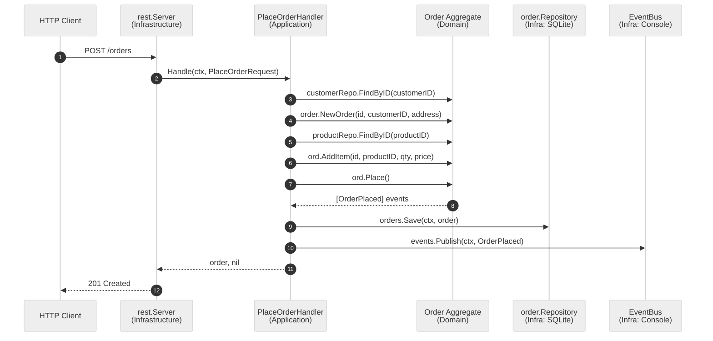
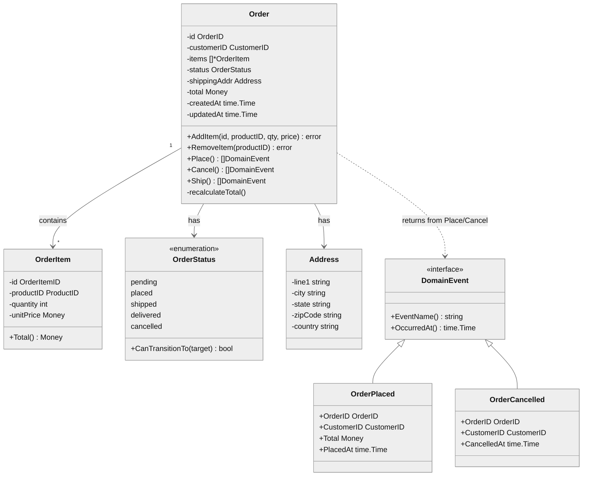
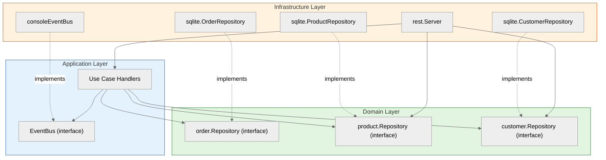
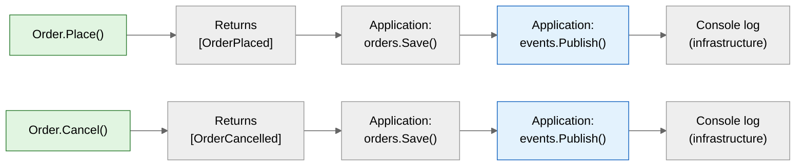

# DDD Architecture Diagram

## 1. Clean Architecture (Hexagonal) Layers

## 2. Request Flow: Place Order

## 3. Aggregate: Order

## 4. Dependency Inversion (Ports & Adapters)

## 5. Domain Event Flow

